# 🔄 SIMT Portal Ortu - Data Flow Documentation

## 📋 Table of Contents
1. [Authentication Flow](#authentication-flow)
2. [Parent Portal Flow](#parent-portal-flow)
3. [Student Portal Flow](#student-portal-flow)
4. [Data Synchronization](#data-synchronization)
5. [Multi-Tenant Architecture](#multi-tenant-architecture)

---

## 🔐 Authentication Flow

### Parent Login Flow

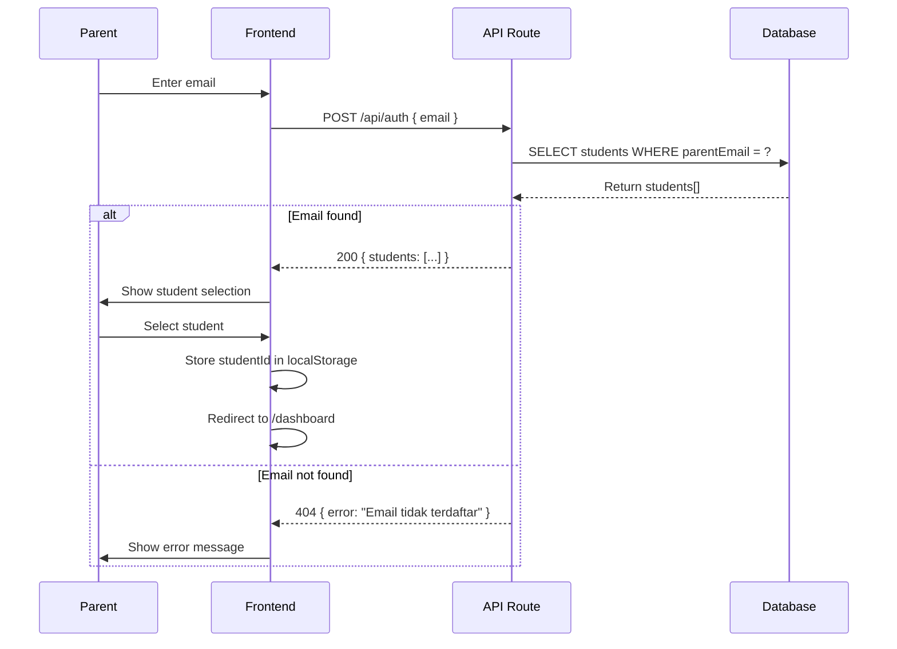

**Key Points:**
- Satu email bisa memiliki beberapa anak
- Tidak ada token/session (MVP - akan diganti)
- studentId disimpan di localStorage client-side
- Filter: `isActive: true` untuk siswa aktif saja

---

### Student Login Flow

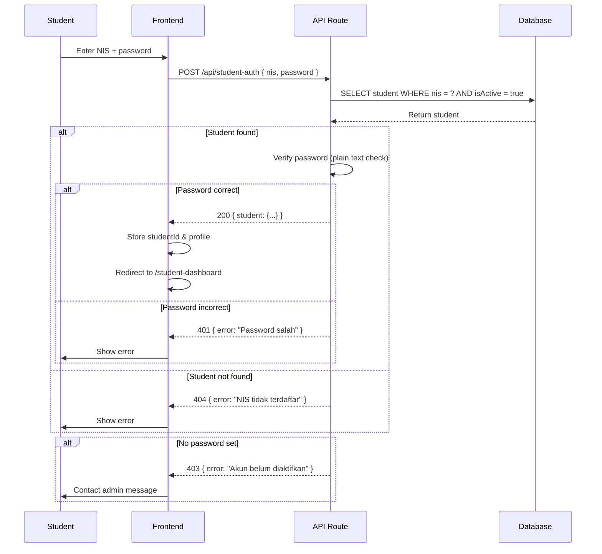

**Security Notes:**
- ⚠️ Password stored as plain text (MVP)
- ⚠️ TODO: Implement bcrypt hashing
- studentPassword harus diset oleh admin dulu
- Akses hanya untuk siswa aktif

---

## 👨‍👩‍👧 Parent Portal Flow

### Dashboard Data Loading

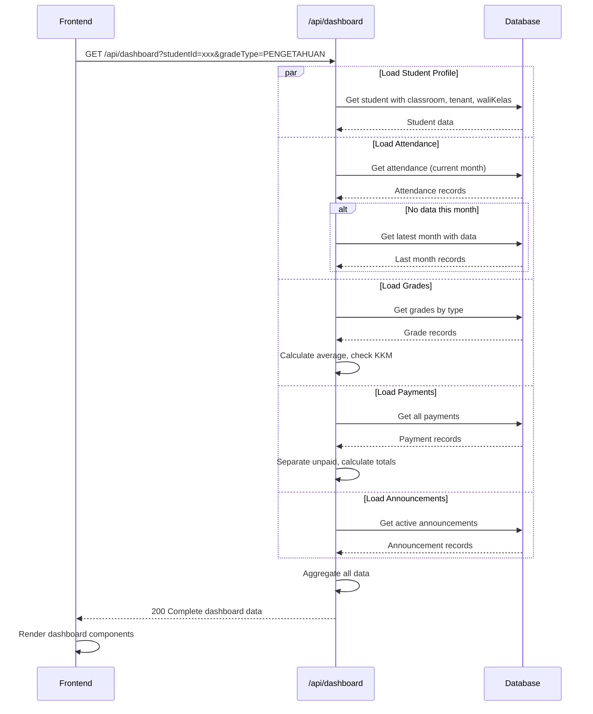

**Data Processing:**
1. **Attendance Summary:**
   - Group by status (HADIR, SAKIT, IZIN, ALPHA)
   - Calculate percentages
   - Smart period detection (current month → fallback to last month)

2. **Grade Summary:**
   - Filter by selected type (PENGETAHUAN, KETERAMPILAN, etc.)
   - Calculate average score
   - Count subjects below KKM
   - Check if all subjects passing (tuntas)

3. **Payment Summary:**
   - Separate paid vs unpaid
   - Calculate total outstanding
   - Calculate total paid
   - Sort by due date

4. **Announcements:**
   - Filter by tenant
   - Show active announcements (not expired)
   - Order by pinned → publishedAt desc

---

### Grade Type Switching

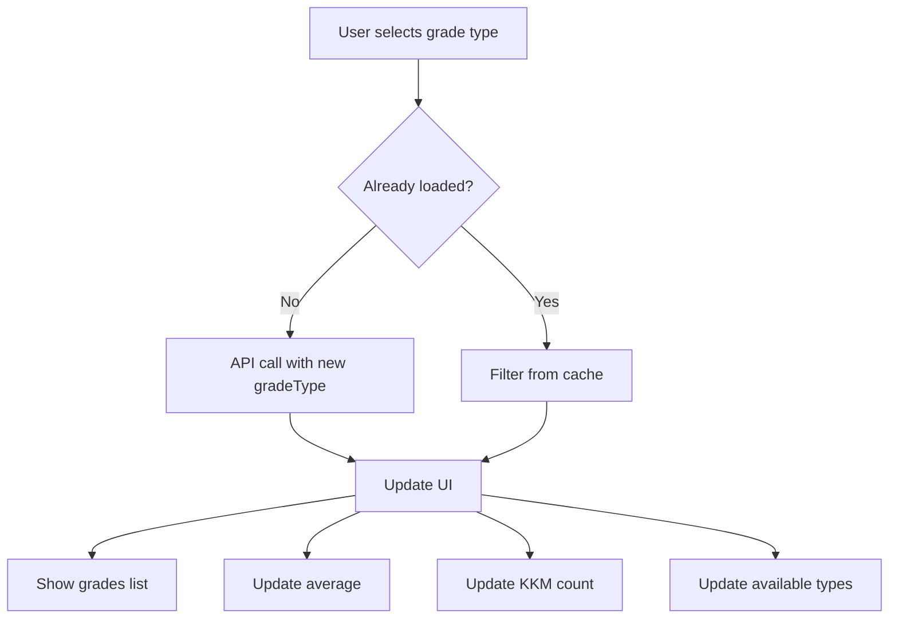

**Query Parameter:**
```
?gradeType=PENGETAHUAN  → Nilai Pengetahuan
?gradeType=KETERAMPILAN → Nilai Keterampilan
?gradeType=UTS          → Nilai Ujian Tengah Semester
?gradeType=UAS          → Nilai Ujian Akhir Semester
?gradeType=SIKAP        → Penilaian Sikap
```

---

## 🎓 Student Portal Flow

### Extended Dashboard Data

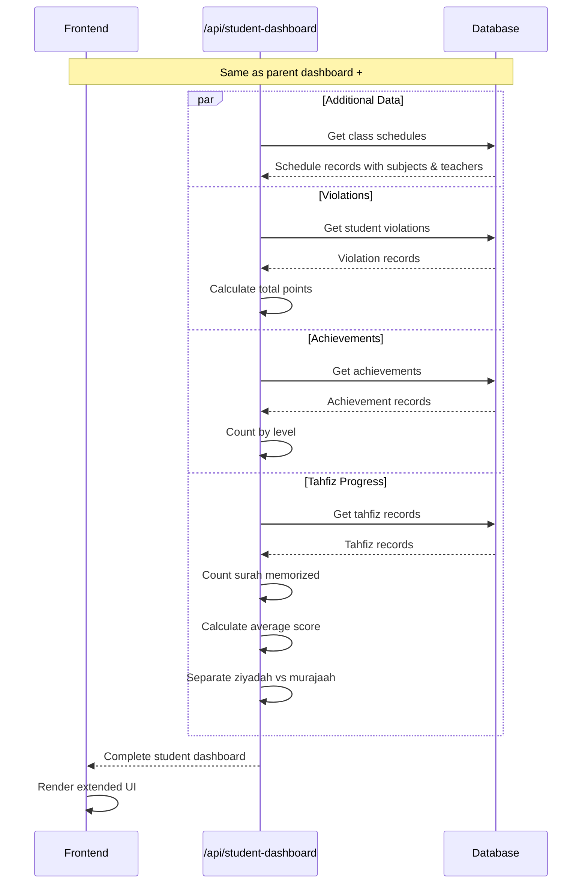

**Additional Features:**

1. **Class Schedule:**
   - Grouped by day of week (1-7)
   - Sorted by period (start → end)
   - Shows subject, teacher, time

2. **Violations:**
   - Total points accumulated
   - Category breakdown
   - Disciplinary actions taken
   - Handled by which teacher/staff

3. **Achievements:**
   - Categorized by type
   - Level (class → international)
   - Certificate links
   - Points/ranking

4. **Tahfiz Progress:**
   - Total Ziyadah (new memorization)
   - Total Murajaah (review)
   - Unique surahs memorized
   - Average fluency score
   - Latest records

---

## 🔄 Data Synchronization

### Real-time Update Pattern (Future)

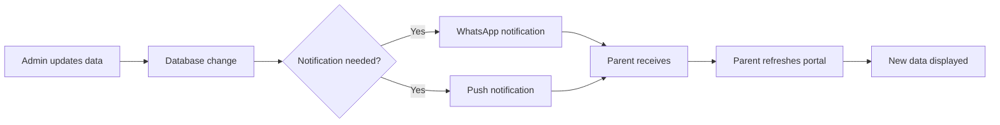

**Current Implementation:**
- Manual refresh required
- No real-time updates
- No push notifications (planned)

**Planned Features:**
- WebSocket for real-time updates
- Service Worker for push notifications
- WhatsApp Baileys integration for alerts

---

### Attendance Entry Flow (Admin Side - Future)

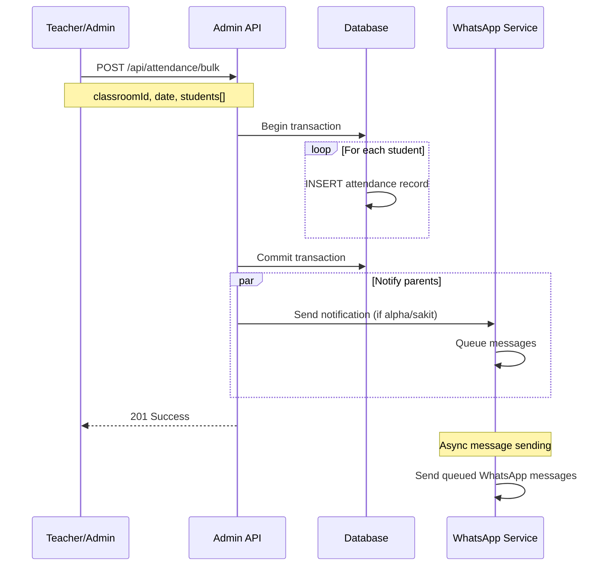

---

## 🏢 Multi-Tenant Architecture

### Tenant Isolation

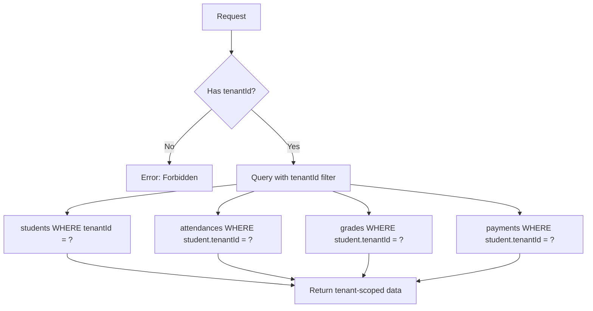

**Isolation Rules:**
1. Every query MUST include tenantId
2. Relations automatically inherit tenant scope
3. No cross-tenant data access
4. Slug used for subdomain routing (future)

**Example Query:**
```typescript
// ✅ Correct
const students = await db.student.findMany({
  where: { tenantId: session.tenantId }
});

// ❌ Wrong - missing tenant filter
const students = await db.student.findMany();
```

---

### Tenant Context Flow

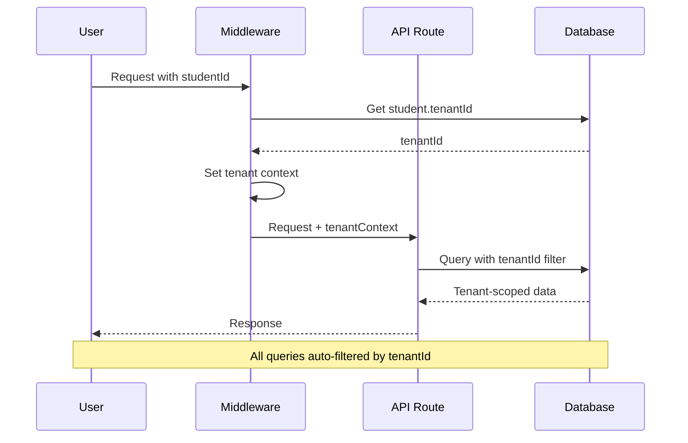

**Implementation (Planned):**
```typescript
// Middleware
export async function tenantMiddleware(req) {
  const studentId = req.query.studentId;
  const student = await db.student.findUnique({
    where: { id: studentId },
    select: { tenantId: true }
  });
  
  req.tenantId = student.tenantId;
  return next();
}
```

---

## 📊 Database Query Optimization

### Efficient Data Loading

```typescript
// ✅ Good - Single query with includes
const student = await db.student.findUnique({
  where: { id: studentId },
  include: {
    classroom: {
      include: {
        academicYear: true,
        waliKelas: { select: { name: true, phone: true } }
      }
    },
    tenant: { select: { name: true, logo: true } }
  }
});

// ❌ Bad - N+1 queries
const student = await db.student.findUnique({ where: { id: studentId } });
const classroom = await db.classroom.findUnique({ where: { id: student.classroomId } });
const academicYear = await db.academicYear.findUnique({ where: { id: classroom.academicYearId } });
// ... multiple round trips
```

**Best Practices:**
1. Use `include` for related data
2. Use `select` to limit fields
3. Batch queries with `Promise.all()` when independent
4. Add database indexes for frequent queries

---

### Parallel Data Fetching

```typescript
// ✅ Good - Parallel fetching
const [student, attendances, grades, payments] = await Promise.all([
  db.student.findUnique({ where: { id: studentId }, include: {...} }),
  db.attendance.findMany({ where: { studentId } }),
  db.grade.findMany({ where: { studentId, type: gradeType } }),
  db.payment.findMany({ where: { studentId } })
]);

// ❌ Bad - Sequential fetching
const student = await db.student.findUnique({ where: { id: studentId } });
const attendances = await db.attendance.findMany({ where: { studentId } });
const grades = await db.grade.findMany({ where: { studentId } });
const payments = await db.payment.findMany({ where: { studentId } });
// Total time = sum of all queries
```

---

## 🔔 Notification Flow (Planned)

### WhatsApp Integration

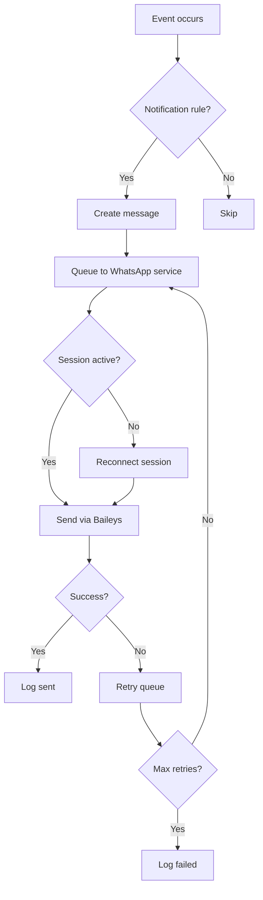

**Notification Triggers:**
- Attendance: Alpha status
- Grades: Below KKM
- Payments: Due date approaching
- Announcements: New urgent announcement
- Violations: New violation recorded

**Message Template:**
```
[MTs Al-Ikhlas]

Assalamu'alaikum Bpk/Ibu {parentName},

{notificationType}:
{message}

Siswa: {studentName} ({nis})
Kelas: {classroom}

Detail: {portalUrl}

Wassalamu'alaikum
```

---

## 📱 Client-Side State Management

### Parent Portal State

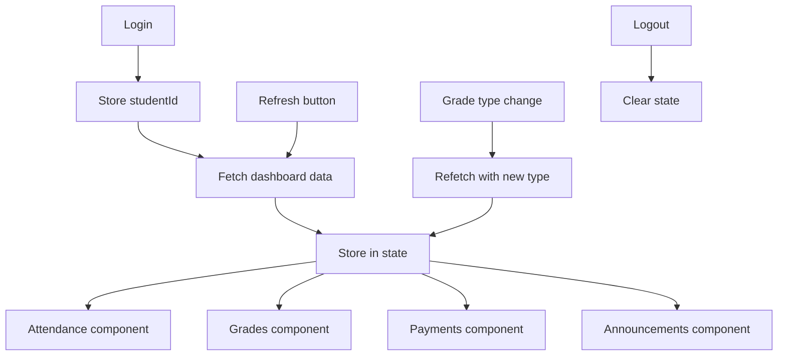

**State Structure:**
```typescript
interface ParentPortalState {
  student: Student | null;
  attendanceSummary: AttendanceSummary;
  grades: GradeSummary;
  payments: PaymentSummary;
  announcements: Announcement[];
  selectedGradeType: GradeType;
  isLoading: boolean;
  error: string | null;
}
```

---

### Student Portal State

```typescript
interface StudentPortalState extends ParentPortalState {
  schedules: Schedule[];
  violations: ViolationSummary;
  achievements: AchievementSummary;
  tahfiz: TahfizSummary;
}
```

---

## 🔍 Search & Filter Patterns

### Attendance Period Selection

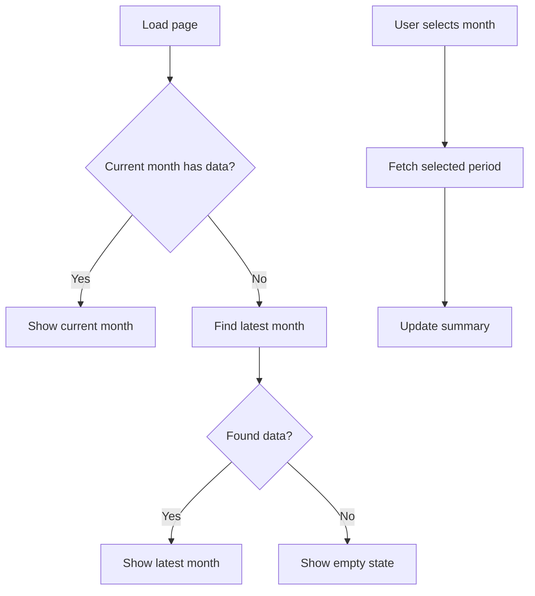

**Smart Fallback Logic:**
```typescript
// 1. Try current month
let data = await getAttendance(currentMonth);

// 2. If empty, find latest
if (data.length === 0) {
  const latest = await getLatestAttendance();
  if (latest) {
    data = await getAttendance(latest.month);
  }
}

return {
  data,
  periodLabel: formatPeriod(data[0]?.date || new Date())
};
```

---

## 🚀 Performance Considerations

### Caching Strategy (Planned)

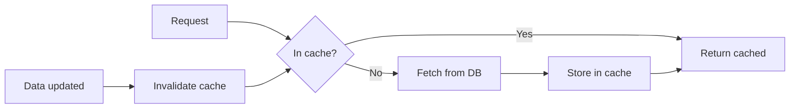

**Cache Candidates:**
- Tenant information (rarely changes)
- Academic year data (stable)
- Subject list (stable)
- Announcements (TTL: 5 minutes)

**Implementation:**
- Redis for session storage
- In-memory cache for reference data
- CDN for static assets

---

## 📈 Analytics & Monitoring (Future)

### Key Metrics to Track

```typescript
interface AnalyticsEvent {
  event: 'login' | 'dashboard_view' | 'grade_view' | 'payment_view';
  userId: string;
  tenantId: string;
  timestamp: Date;
  metadata?: Record<string, any>;
}
```

**Tracked Events:**
- Login frequency
- Most viewed sections
- Average session duration
- Error rates by endpoint
- Response time per query

---

## 🛡️ Security Flow

### Request Validation (Planned)

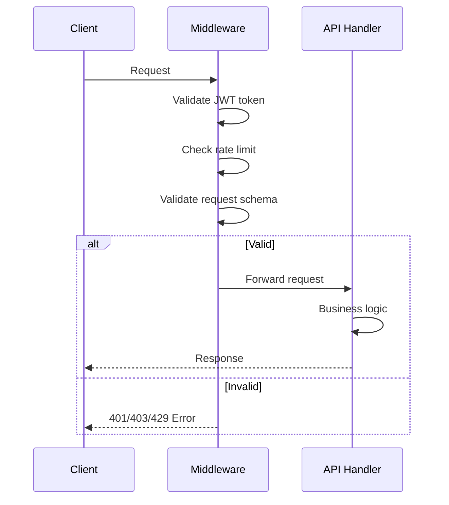

**Validation Layers:**
1. JWT token verification
2. Rate limiting (per IP/user)
3. Request schema validation (Zod)
4. Business rule validation
5. SQL injection prevention (Prisma ORM)

---

## 📝 Summary

### Current Implementation
✅ Basic authentication (email/NIS+password)  
✅ Multi-tenant data isolation  
✅ Parent & Student dashboards  
✅ Smart attendance period detection  
✅ Grade type filtering  
✅ Payment tracking  

### Planned Features
⏳ JWT-based session management  
⏳ Real-time notifications  
⏳ WhatsApp integration  
⏳ Push notifications  
⏳ Advanced caching  
⏳ Analytics dashboard  
⏳ Rate limiting  
⏳ Request validation middleware  

---

**Documentation Version:** 1.0.0  
**Last Updated:** Juni 2026  
**Related Docs:** [API Documentation](./API_DOCUMENTATION.md), [OpenAPI Spec](./openapi.yaml)
